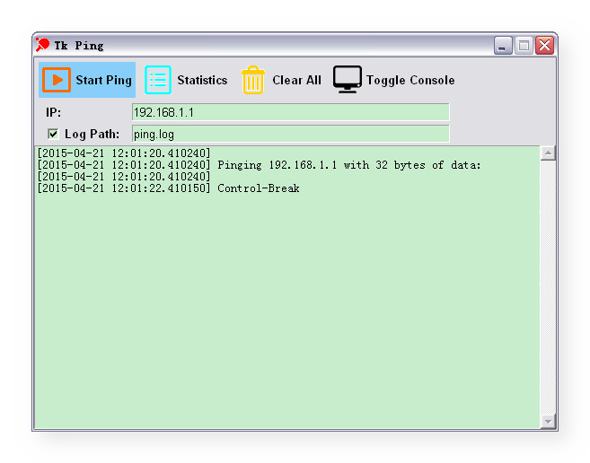

# Tk Ping

Tk Ping is a GUI version for windows ping.exe.

##Features:

* log to file
* date and time for each line
* periodic statistics

It is also a sample for Python GUI programming using Tkinter shows you how to:

* layout using *.grid()*
* create button with image
* create readonly text
* change font style in Tkinter
* embed image resources into code
* use multithreading
* create subprocess and redirect stdout
* send signal to subprocess
